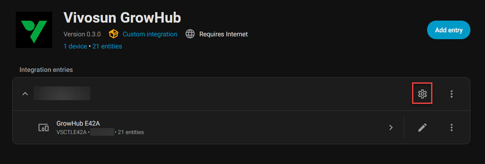
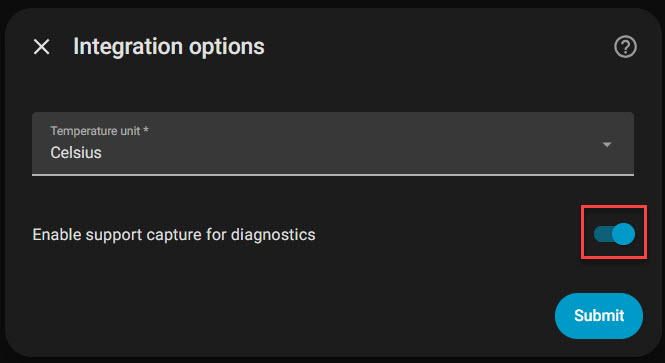
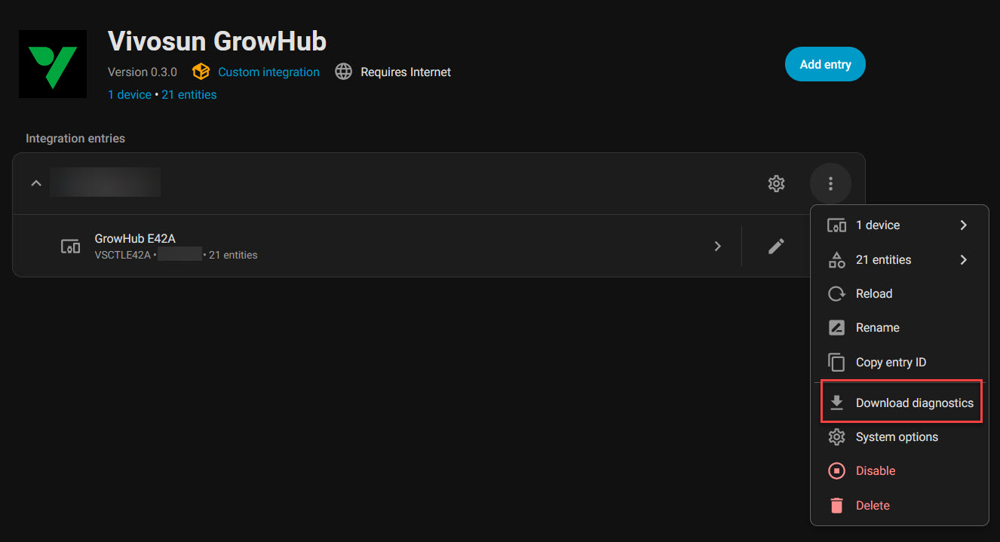

# Support Capture Recon Checklist

Use this once and send back the resulting diagnostics JSON file.

## 1. Open the integration options

Go to **Settings → Devices & Services → Vivosun GrowHub**, then open the integration options with the cog button.

## 2. Enable support capture

Turn on **Enable support capture for diagnostics**, then submit.

Wait for the integration to finish reloading before continuing.

## 3. Reproduce the problem once

Do a short, deliberate test run.

If the device already has Home Assistant controls, use them once.

If the device does not have working Home Assistant controls yet, use the **Vivosun app** instead.

Recommended actions:

1. Open the target device in the app.
2. Toggle power on and off once.
3. Change the main control once, if available:
   - light level
   - fan speed
   - humidifier/dehumidifier target
   - mode / oscillation / other relevant setting
4. Wait a few seconds between actions so the state changes have time to publish.

## 4. Download diagnostics

Go back to the integration and use **Download diagnostics**.

Send back the downloaded `config_entry-vivosun_growhub-*.json` file.

## 5. Turn support capture back off

Open the integration options again, disable **Enable support capture for diagnostics**, and save.
